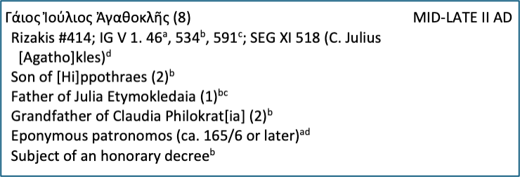

# Prosopography of the Lacedaemonians

This is a repository for the digital version of [*A Prosopography of Lacedaemonians from the Death of Alexander the Great, 323 B.C., to the Sack of Sparta by Alaric, A.D. 396*](https://archive.org/details/prosopographyofl0000pora), by Alfred S. Bradford (C. H. Beck, 1977).

This is part of a larger effort to demonstrate potential workflows for creating a Minimally Viable Project (MVP), that is, a digital project that requires minimal resources for its creation, maintenance, and preservation. For a good overview of this approach, see the [Lib-Static site](https://lib-static.github.io/).

In this instance, [Professor Alfred S. Bradford](https://www.ou.edu/cas/history/people/faculty/alfred-bradford) wants to update his prosopography of the Lacedaemonians. Although a printed prosopography is a useful resource, it is not easily searchable or accessible to a wide audience. Therefore, it makes sense to publish a new edition of the work in digital form.

Bradford recreated his original work using Microsoft Word, which is technically a digital format, but it only merits one star for Linked Open Data, according to [Sir Tim Berners-Lee](https://www.w3.org/DesignIssues/LinkedData)'s formulation:

>⭐️  Available on the web (whatever format) but with an open licence, to be Open Data

>⭐️⭐️  Available as machine-readable structured data (e.g. excel instead of image scan of a table)

>⭐️⭐️⭐️  as (2) plus non-proprietary format (e.g. CSV instead of excel)

>⭐️⭐️⭐️⭐️ All the above plus, Use open standards from W3C (RDF and SPARQL) to identify things, so that people can point at your stuff

>⭐️⭐️⭐️⭐️⭐️ All the above, plus: Link your data to other people’s data to provide context

The aim of this project is ultimately to be fully compliant with those best practices. The more immediate goal, however, is to transform the original Word document into structured data of some kind.

## The original file

The information in the [original Word document](https://github.com/sjhuskey/bradford/blob/main/sources/prosopography.docx) has an idiosyncratic structure. 

- It is organized alphabetically by name
- Each entry begins with a table with a single row and two columns: one for the name, the other for the [floruit](https://en.wikipedia.org/wiki/Floruit) of the individual.
- The second line, outside of the table, contains sources of information. If there is more than one source, the sources are separated by semicolons. The sources usually have a superscript letter to distinguish them. That superscript letter applies only to that person. In other words, the superscript series starts over with each person.
- Any additional lines contain facts about the individual named in first line, with references to the sources in the second line. The references take the form of superscript letters corresponding to the letters used in the second line.

Here is an example:



## The structured data version

In consultation with a team of [digital scholarship specialists](https://libraries.ou.edu/units/digital-scholarship-and-data-services) at the [University of Oklahoma Libraries](https://libraries.ou.edu/), I converted the [original Word document](https://github.com/sjhuskey/bradford/blob/main/sources/prosopography.docx) into an [XML file](https://en.wikipedia.org/wiki/XML) using the [Text Encoding Initiative](https://tei-c.org/)'s [XSLT Stylesheets](https://github.com/TEIC/Stylesheets). That merely reproduced the features of the original Word file in TEI XML. With the help of [ChatGPT](https://chatgpt.com/) (5.1), I generated a custom XSLT to convert the tables and paragraphs into `person` elements:

```xml
<person xml:id="grp-38">
    <name>Γάιος Ἰούλιος Ἀγαθοκλῆς (8)</name>
    <floruit>MID-LATE II AD</floruit>
    <note>Rizakis #414; IG V 1. 46<hi rend="superscript">a</hi>, 534<hi
            rend="superscript">b</hi>, 591<hi rend="superscript">c</hi>; SEG XI 518 (C.
        Julius </note>
    <note>[Agatho]kles)<hi rend="superscript">d</hi>
    </note>
    <note>Son of [Hi]ppothraes (2)<hi rend="superscript">b</hi>
    </note>
    <note>Father of Julia Etymokledaia (1)<hi rend="superscript">bc</hi>
    </note>
    <note>Grandfather of Claudia Philokrat[ia] (2)<hi rend="superscript">b</hi>
    </note>
    <note>Eponymous patronomos (ca. 165/6 or later)<hi rend="superscript">ad</hi>
    </note>
    <note>Subject of an honorary decree<hi rend="superscript">b</hi>
    </note>
</person>
```

In this way, each `person` has a unique `xml:id`, the floruit is encoded appropriately with `floruit`, and the `note` elements are at least visually linked by preserving the original scheme of locally-scoped superscript notations.

Moreover, each letter of the alphabet is the `head` for a `listPerson` that contains all the relevant `person` elements.

## HTML version

Again with the help of ChatGPT (5.1), I generated another [XSLT to transform the XML into a set of static HTML files](https://github.com/sjhuskey/bradford/blob/main/sources/custom-xslt.xsl): an index and one for each letter of the alphabet. 

To make the pages responsive to different screen sizes, I used the [Bootstrap](https://getbootstrap.com/) framework, adding a sticky [footer](https://getbootstrap.com/docs/5.3/examples/sticky-footer/).

These static HTML files can be viewed locally or they can be hosted on basic service such as GitHub pages, as they are currently at [https://sjhuskey.info/bradford](https://sjhuskey.info/bradford).

## Next steps

The first step is to proofread this version of the data. Another version has been carefully reviewed by two undergraduate research assistants. For various technical reasons, it was difficult to merge that version into this one. There are plans to hire another assistant to compare the versions and modify the XML document accordingly.

After synchronizing the two versions and making sure that the canonical XML file is correct and up to date, we plan to generate another XSLT to transform the XML file into RDF triples and/or [JSON-LD](https://json-ld.org/). That will necessitate:

- Refining the `person` elements to make better use of the [relevant TEI elements and attributes](https://tei-c.org/release/doc/tei-p5-doc/en/html/ref-person.html)
- Selecting metadata terms and building an ontology
- Creating a lightweight SPARQL endpoint for querying the RDF graph

## Acknowledgments

In addition to Alfred S. Bradford, who did the research and scholarship to produce the content represented here, the following people have been instrumental at various stages of this project:

### University of Oklahoma Libraries
- Jessica Davila, Associate Dean for Digital Strategies & Innovation, OU Libraries
- Tyler Pearson, Director, Digital Scholarship and Data Services
- Varun Sayapaneni, Research Informatics Specialist, OU Libraries
- Bennie Stoll, formerly of OU Libraries, now at the University of California, Long Beach
- Brianna Wright, Digital Scholarship Librarian, OU Libraries

### Student Assistants

- Victoria Smith, Classics and Letters undergraduate
- Josie Callen, Classics and Letters undergraduate

Danni McCutchen, Administrative and Financial Coordinator for the Department of History at the University of Oklahoma, provided administrative support for hiring the students.