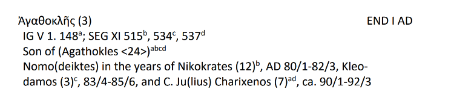
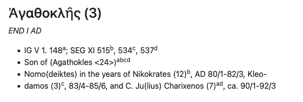
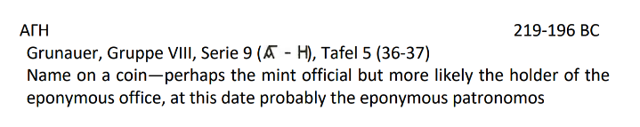
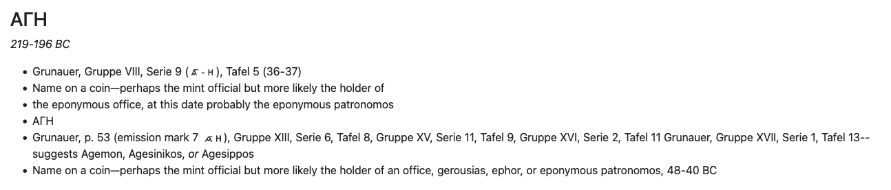

## Background

This project aims to create a digital edition of [*A Prosopography of Lacedaemonians from the Death of Alexander the Great, 323 B.C., to the Sack of Sparta by Alaric, A.D. 396*](https://archive.org/details/prosopographyofl0000pora), by Alfred S. Bradford (C. H. Beck, 1977). Dr. Bradford is a professor in the Department of History at the University of Oklahoma.

A *prosopography* is "a study that identifies and relates a group of persons or characters within a particular historical or literary context"^[ “Prosopography.” Merriam-Webster.com Dictionary, Merriam-Webster, <https://www.merriam-webster.com/dictionary/prosopography>. Accessed 19 Jan. 2026.] In this case, the group of persons is the people of Lacedaemonia, a historical region in the Pelponnese.

Dr. Bradford has updated his manuscript and entered it anew into a [Microsoft Word document](https://github.com/sjhuskey/bradford/blob/main/sources/prosopography.docx). The file has an idiosyncratic structure:

- It is organized alphabetically by name in Greek characters (e.g., "Γάιος Ἰούλιος Ἀγαθοκλῆς (8)")
- Each entry begins with a table with a single row and two columns: one for the name, the other for the [floruit](https://en.wikipedia.org/wiki/Floruit) of the individual.
- The second line, outside of the table, contains sources of information. If there is more than one source, the sources are separated by semicolons. The sources usually have a superscript letter to distinguish them. That superscript letter applies only to that person. In other words, the superscript series starts over with each person.
- Any additional lines contain facts about the individual named in first line, with references to the sources in the second line. The references take the form of superscript letters corresponding to the letters used in the second line.

Here is an example:


That file was converted into structured data in XML marked up according to the guidelines of the [Text Encoding Initiative](https://tei-c.org/). The file is in the Teams folder (see below) as `prosopography-lacedaemonians.xml`. The entry above has been encoded as follows:

```xml
<person xml:id="grp-38">
    <name>Γάιος Ἰούλιος Ἀγαθοκλῆς (8)</name>
    <floruit>MID-LATE II AD</floruit>
    <note>Rizakis #414; IG V 1. 46<hi rend="superscript">a</hi>, 534<hi
            rend="superscript">b</hi>, 591<hi rend="superscript">c</hi>; SEG XI 518 (C.
        Julius </note>
    <note>[Agatho]kles)<hi rend="superscript">d</hi>
    </note>
    <note>Son of [Hi]ppothraes (2)<hi rend="superscript">b</hi>
    </note>
    <note>Father of Julia Etymokledaia (1)<hi rend="superscript">bc</hi>
    </note>
    <note>Grandfather of Claudia Philokrat[ia] (2)<hi rend="superscript">b</hi>
    </note>
    <note>Eponymous patronomos (ca. 165/6 or later)<hi rend="superscript">ad</hi>
    </note>
    <note>Subject of an honorary decree<hi rend="superscript">b</hi>
    </note>
</person>
```

That XML is the basis for the web version of the prosopography at <https://sjhuskey.info/bradford>. The HTML pages for that site were generated by an XSL Stylesheet Language Transformation (XSLT). The pages are currently hosted using [GitHub Pages](https://docs.github.com/en/pages).

## Teams: Reconciliation

You will be added to a Microsoft Teams channel called "Reconciliation". It contains six files that you may download for reference during the tasks described below.

1. `newmvp1.docx`: one third of `prosopography.docx`, proofread by a previous research assistant
2. `newmvp2-vs.docx`: one third of `prosopography.docx`, proofread by a previous research assistant
3. `newmvp3-vs.docx`: one third of `prosopography.docx`, proofread by a previous research assistant
4. `prosopography.docx`: Dr. Bradford's original Microsoft Word document
5. `prosopography-data-spaces-removed.pdf`: a PDF version of Dr. Bradford's Microsoft Word document

## VS Code Setup

1. Download and install the latest version of VS Code for your operating system: <https://code.visualstudio.com/download>
2. Navigate to the Extensions tab
3. Install the Redhat XML extension: <https://marketplace.visualstudio.com/items?itemName=redhat.vscode-xml>

## Tasks

If you have any doubts or questions during these tasks, contact Dr. Huskey. 

Really. 

Don't hesitate. It is better to ask a question than to guess what the correct procedure is. 😀

## Task 1: Correct Broken Hyphenation

Your first task is to compare the HTML version at <https://sjhuskey.info/bradford> of the prosopography to the PDF `prosopography-data-spaces-removed.pdf` in the Teams directory. Work from the beginning to the end, comparing each individual's entry in the HTML version to the corresponding entry in the PDF. 

Look especially for words that are hyphenated in the original PDF and are incorrectly split into separate bullet items in the HTML. This happened because a line break was inserted after most hyphens in the original Word document. 😕 That line break was automatically carried over into the XML version of the file. 🙁

Your task is to eliminate those extraneous line breaks and rejoin the hyphenated words by deleting the hyphen.

For example, the name "Kleodamas" is hyphenated and split onto the next line in the PDF:



In the HTML file, a line break has accidentally been inserted, causing the name to be broken into two bullet items:



In the XML file, that entry looks like this:

```xml
<person xml:id="grp-32">
    <name>Ἀγαθοκλῆς (3)</name>
    <floruit>END I AD</floruit>
    <note>IG V 1. 148<hi rend="superscript">a</hi>; SEG XI 515<hi rend="superscript"
            >b</hi>, 534<hi rend="superscript">c</hi>, 537<hi rend="superscript">d</hi>
    </note>
    <note>Son of (Agathokles &lt;24&gt;)<hi rend="superscript">abcd</hi>
    </note>
    <note>Nomo(deiktes) in the years of Nikokrates (12)<hi rend="superscript">b</hi>, AD
        80/1-82/3, Kleo-</note>
    <note>damos (3)<hi rend="superscript">c</hi>, 83/4-85/6, and C. Ju(lius) Charixenos
            (7)<hi rend="superscript">ad</hi>, ca. 90/1-92/3</note>
</person>
```

In this case, you should edit the XML as follows:

1. Delete the hyphen after "Kleo"
2. Delete the closing `</note>` tag after "Kleo"
3. Delete the opening `<note>` tag before "damos"
4. Join "Kleo" and "damos" to make the name "Kleodamos".
5. Leave an XML comment like this: `<!-- Correction: deleted hypen and fixed broken line -->`
6. Save the file

**Tip**: You might be able to save some time by doing a "find" command for `-</note>`, but use care not to do a global replace operation using that pattern. Instead, correct each instance of broken hyphenation manually.

## Task 2: Look for Missing Images

Some of the letters and characters in the PDF are actually images, since those characters do not exist in a font. 

For example, here is an entry with characters reproduced as images (in parentheses after "Serie 9"):



And here is the same entry in HTML:



Most of them should have been transferred to the HTML version, but be watchful for missing items.

The most straightforward way of doing this is probably to use the full desktop version of Microsoft Word to open the Word document `prosopography.docx` (in the Teams folder), then select `Edit > Find > Advanced Find and Replace` and search for the special character `^g`, which stands for "graphic". That will let you go from graphic to graphic, verifying that each graphic is present in the HTML version.

## Task 3: Verify spellings

A review by previous undergraduate research assistants was conducted on a different version of the prosopography. Their work is in three files in the Prosopography Teams channel "Reconciliation". The files are:

1. `newmvp1.docx`
2. `newmvp2-vs.docx`
3. `newmvp3-vs.docx`

You should start with `newmvp1.docx` and proceed sequentially until you reach the end of `newmvp3-vs.docx`.

First, you should scroll through each `.docx` file and look for any comments or corrections to the names of individuals. Use the "Track Changes" feature in Word and click on the "Next" button to go from one correction to the next. If you find a name that has been corrected:

1. Copy the the name as it appears in the Word document.
2. With the XML file `prosopography.xml` open in VS Code, paste the correct name into the `<name>` field for that entry. Double- and triple-check that you are correcting the right individual's entry in the XML.